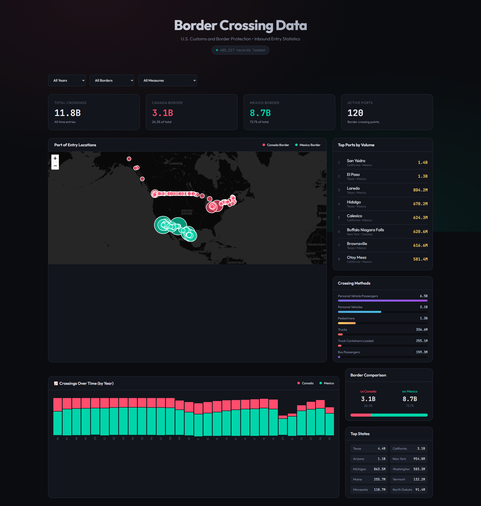

# 🛂 U.S. Border Crossing Data Dashboard

An interactive visualization dashboard for exploring **U.S. Customs and Border Protection** border crossing entry data. Analyze ~400,000 records of inbound crossings at U.S.-Canada and U.S.-Mexico border ports from 1996-2025.

## 🌐 Live Demo

**[View Live Dashboard →](https://immike.github.io/US-Border-Crossing-Data-App/)**

## 📸 Screenshot



## ✨ Features

- **Interactive Map** - Visualize all border crossing ports with size indicating volume
- **Real-time Filtering** - Filter by year, border (Canada/Mexico), and crossing type
- **Top Ports Ranking** - See busiest ports like San Ysidro, El Paso, Laredo
- **Crossing Methods Breakdown** - Personal vehicles, trucks, pedestrians, buses, trains
- **Timeline Chart** - View trends over time by year or drill down to monthly data
- **Sorting Options** - Sort timeline by date, volume, or by border
- **Border Comparison** - Canada vs Mexico crossing statistics

## 📊 Data

Data sourced from the [Bureau of Transportation Statistics](https://www.bts.gov/browse-statistical-products-and-data/border-crossing-data/border-crossingentry-data):

- **405,000+** records
- **120** active ports of entry
- **12** crossing measure types (vehicles, passengers, trucks, pedestrians, etc.)
- **1996-2025** date range

## 🛠️ Tech Stack

- Pure **HTML/CSS/JavaScript** - No frameworks required
- **Leaflet.js** - Interactive mapping
- **Gzip compression** - 115MB → 19MB for fast loading

## 🚀 Local Development

1. Clone the repository
2. Serve with any local server:
   ```bash
   python -m http.server 8000
   ```
3. Open http://localhost:8000

## 📝 License

Data is public domain via U.S. Department of Homeland Security.

---

Built with ❤️ for data visualization

